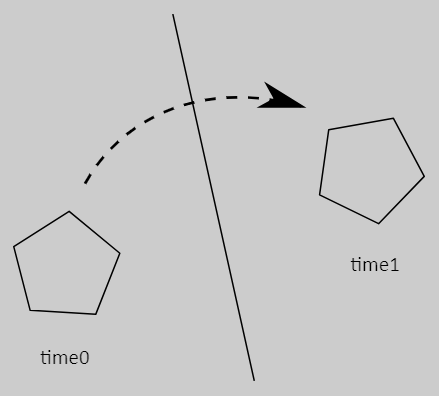

# Box2D

## Overview

Box2D는 게임을 위한 2D 강체 시뮬레이션 라이브러리입니다. 프로그래머들은 게임에서 이 라이브러리를 사용하여 객체가 현실감 있게 움직이도록 하고 게임 세계를 더 상호작용적으로 만들 수 있습니다. 게임 엔진의 관점에서 물리 엔진은 단지 절차적 애니메이션을 위한 시스템에 불과합니다.

Box2D는 표준 C11로 작성되었습니다. 엔진에서 정의된 대부분의 타입은 b2 접두사로 시작합니다. 이는 여러분의 애플리케이션과 이름 충돌을 피하기에 충분하다고 생각됩니다.

## Prerequisites

이 매뉴얼에서는 질량, 힘, 토크, 충격과 같은 기본 물리 개념에 익숙하다고 가정합니다. 만약 그렇지 않다면, 먼저 Google 검색과 Wikipedia를 참조해 주시기 바랍니다.

Box2D는 Game Developer Conference에서 물리학 튜토리얼의 일환으로 만들어졌습니다. 이 튜토리얼들은 box2d.org의 publications 섹션에서 얻을 수 있습니다.

Box2D는 C로 작성되었으므로, C 프로그래밍에 대한 경험이 필요합니다. Box2D는 첫 번째 C 프로그래밍 프로젝트가 되어서는 안 됩니다! 컴파일, 링크, 디버깅에 익숙해야 합니다.


**주의**: Box2D는 첫 번째 C 프로젝트로 삼아서는 안 됩니다. Box2D를 사용하기 전에 C 프로그래밍, 컴파일, 링크, 디버깅을 먼저 배우시기 바랍니다. 이를 위한 다양한 온라인 자료가 있습니다.



## Scope

이 매뉴얼은 Box2D API의 대부분을 다룹니다. 하지만 모든 부분을 다루지는 않습니다. 더 많은 정보를 얻기 위해 Box2D에 포함된 참조 섹션과 샘플 애플리케이션을 참고하시기 바랍니다.

이 매뉴얼은 새로운 릴리스와 함께만 업데이트됩니다. 최신 버전의 Box2D가 이 매뉴얼과 동기화되지 않을 수 있습니다.


## Feedback and Bugs

버그 신고와 기능 요청은 여기에서 제출해 주세요: Box2D Issues

충분한 세부 정보를 제공하면 문제를 해결하는 데 도움이 됩니다. 문제를 재현할 수 있는 테스트베드 예제가 이상적입니다. 테스트베드에 대해서는 이 문서의 후반부에서 읽어보실 수 있습니다.

또한 Box2D를 위한 Discord 서버와 subreddit도 있습니다.


## Core Concepts

Box2D는 몇 가지 기본 개념과 객체를 사용합니다. 여기서는 이 객체들을 간단히 정의하고, 더 자세한 내용은 이 문서의 후반부에서 다룹니다.

### rigid body

물질 덩어리 중에서 매우 단단하여, 덩어리 내의 어느 두 점 사이의 거리가 일정하게 유지되는 것을 말합니다. 이들은 다이아몬드처럼 단단합니다. 이후 논의에서는 몸체(body)와 강체(rigid body)를 서로 바꿔가며 사용합니다.

### shape

형상은 충돌 지오메트리를 몸체에 연결하고, 밀도, 마찰, 반발력과 같은 물질 특성을 추가합니다. 형상은 충돌 지오메트리를 충돌 시스템(브로드 페이즈)에 넣어 다른 형상과 충돌할 수 있도록 합니다.

### constraint <a href="#autotoc_md7" id="autotoc_md7"></a>

이동 좌표와 하나의 회전 좌표)를 가집니다. 몸체를 벽에 고정시키면(예: 진자처럼) 몸체를 벽에 구속시킨 것입니다. 이 시점에서 몸체는 핀 주위에서만 회전할 수 있으므로, 이 구속 조건은 2개의 자유도를 제거한 것입니다.

### contact constraint <a href="#autotoc_md8" id="autotoc_md8"></a>

강체의 관통을 방지하고 마찰과 반발력을 시뮬레이션하기 위해 설계된 특수 구속 조건입니다. 접촉 구속 조건은 사용자가 생성하지 않으며, Box2D에 의해 자동으로 생성됩니다.

### joint constraint <a href="#autotoc_md9" id="autotoc_md9"></a>

두 개 이상의 몸체를 함께 고정하는 데 사용되는 구속 조건입니다. Box2D는 회전, 프리즘, 거리 등 여러 종류의 관절을 지원합니다. 관절에는 한계, 모터, 스프링이 있을 수 있습니다.

### joint limit <a href="#autotoc_md10" id="autotoc_md10"></a>

관절 한계는 관절의 운동 범위를 제한합니다. 예를 들어, 사람의 팔꿈치는 특정 각도 범위만 허용합니다.

### joint motor <a href="#autotoc_md11" id="autotoc_md11"></a>

관절 모터는 관절의 자유도에 따라 연결된 몸체의 운동을 구동합니다. 예를 들어, 모터를 사용하여 팔꿈치의 회전을 구동할 수 있습니다. 모터는 목표 속도와 최대 힘 또는 토크를 가집니다. 시뮬레이션은 원하는 속도를 달성하기 위해 필요한 힘이나 토크를 적용합니다.

### joint spring <a href="#autotoc_md12" id="autotoc_md12"></a>

관절 스프링은 강성(stiffness)과 감쇠(damping)를 가집니다. Box2D에서 스프링 강성은 헤르츠 또는 초당 주기로 표현됩니다. 이를 통해 몸체의 질량에 관계없이 스프링이 얼마나 빠르게 반응하는지를 설정할 수 있습니다. 관절 스프링은 또한 스프링이 얼마나 빨리 정지할지를 지정할 수 있는 감쇠 비율을 가지고 있습니다.

### world <a href="#autotoc_md13" id="autotoc_md13"></a>

물리 월드는 상호작용하는 몸체, 형상, 관절 및 접촉의 집합입니다. Box2D는 서로 완전히 독립적인 여러 월드를 생성하는 것을 지원합니다.

### solver <a href="#autotoc_md14" id="autotoc_md14"></a>

물리 월드는 시간을 진행시키고 접촉 및 관절 구속 조건을 해결하기 위해 솔버를 사용합니다. Box2D 솔버는 고성능의 순차 솔버로, 구속 조건의 수가 N일 때 시간 복잡도가 O(N)입니다.


### continuous collision

솔버는 이산 시간 간격을 사용하여 몸체를 시간적으로 진행시킵니다. 개입이 없으면 이는 터널링(tunneling) 현상을 초래할 수 있습니다.

<figure><figcaption></figcaption></figure>

Box2D는 터널링(tunneling) 문제를 해결하기 위해 특수화된 알고리즘을 포함하고 있습니다. 첫째, 충돌 알고리즘은 두 몸체의 움직임을 보간하여 최초 충돌 시점(Time of Impact, TOI)을 찾습니다. 둘째, 추측적 충돌(speculative collision)을 사용하여 몸체가 접촉하기 전에 접촉 제약을 생성합니다.


### events

월드 시뮬레이션은 시간 간격이 끝날 때 사용할 수 있는 이벤트를 생성합니다:

* **몸체 이동 이벤트 (body movement events)**
* **접촉 시작 및 종료 이벤트 (contact begin and end events)**
* **접촉 히트 이벤트 (contact hit events)**

이러한 이벤트는 애플리케이션이 시뮬레이션의 변화에 반응할 수 있도록 합니다.


## Modules

Box2D의 주요 목적은 강체 시뮬레이션을 제공하는 것입니다. 그러나 강체 시뮬레이션 외에도 유용할 수 있는 수학 및 충돌 관련 기능이 있습니다. 이러한 기능들은 `include` 디렉토리에 제공됩니다. `include` 디렉토리의 모든 것은 공용(public)으로 간주되며, `src` 디렉토리의 모든 것은 내부(internal)로 간주됩니다.

공용 기능은 지원되며, 이에 대해 도움을 받으려면 Discord 서버를 이용할 수 있습니다. 내부 코드를 직접 사용하는 것은 지원되지 않습니다.


## Units

Box2D는 부동 소수점 숫자를 사용하며, Box2D가 잘 작동하도록 하려면 허용 오차를 사용해야 합니다. 이러한 허용 오차는 미터-킬로그램-초(MKS) 단위와 잘 맞도록 조정되어 있습니다. 특히, Box2D는 0.1미터에서 10미터 사이의 이동형 물체와 잘 작동하도록 조정되어 있습니다. 즉, 수프 캔에서 버스 크기까지의 물체는 잘 작동해야 합니다. 정적 형태는 50미터까지 문제 없이 사용할 수 있습니다. 큰 월드가 있을 경우, 이를 여러 개의 정적 몸체로 나누어야 합니다.

2D 물리 엔진이기 때문에 픽셀을 단위로 사용하는 것이 유혹적일 수 있습니다. 그러나 이는 시뮬레이션이 좋지 않거나 이상한 동작을 초래할 수 있습니다. 200픽셀 길이의 물체는 Box2D에서 45층 건물의 크기로 인식될 수 있습니다.


**주의:** Box2D는 MKS 단위에 맞게 조정되어 있습니다. 이동 물체의 크기는 1cm보다 커야 합니다. 환경과 액터를 렌더링할 때는 스케일링 시스템을 사용해야 합니다. Box2D 샘플 애플리케이션은 OpenGL 뷰포트 변환을 사용하여 이를 처리합니다. 픽셀 단위를 사용하지 마세요, 그 의미를 이해하지 못하는 경우에는 더더욱 그렇습니다.


Box2D의 몸체를 이동하는 광고판으로 생각하는 것이 좋습니다. 이 광고판에는 당신의 아트를 부착할 수 있습니다. 광고판은 미터 단위 시스템에서 이동할 수 있지만, 이를 간단한 스케일링 계수로 픽셀 좌표로 변환할 수 있습니다. 그런 다음 이러한 픽셀 좌표를 사용하여 스프라이트 등을 배치할 수 있습니다. 좌표 축이 뒤집힌 경우도 고려할 수 있습니다.

또한 고려해야 할 제한 사항은 전체 월드 크기입니다. 월드 단위가 약 12킬로미터를 초과하면, 정밀도 손실이 안정성에 영향을 줄 수 있습니다.



**주의:** Box2D는 월드 크기가 12킬로미터 이하일 때 가장 잘 작동합니다. 시뮬레이션 조정을 신중하게 하면, 약 24킬로미터까지 확장할 수 있으며, 이는 대부분의 게임 월드보다 훨씬 큽니다.


Box2D는 각도에 라디안을 사용합니다. 몸체의 회전은 복소수로 저장되므로, 몸체의 각도를 조회할 때 그 값은 -π와 π 라디안 사이가 됩니다.


**주의:** Box2D는 도(degrees) 대신 라디안(radians)을 사용합니다.



## Changing the length units

고급 사용자는 애플리케이션 시작 시 `b2SetLengthUnitsPerMeter()`를 호출하여 길이 단위를 변경할 수 있습니다. Box2D를 공유 라이브러리로 유지하는 경우, 공유 라이브러리가 다시 로드될 때 이 함수를 호출해야 합니다.

길이 단위를 픽셀로 변경하면, 몇 픽셀이 1미터를 나타내는지 결정해야 합니다. 또한 중력, 밀도, 힘, 토크에 대한 적절한 값을 결정해야 합니다. 물리 시뮬레이션에 MKS 단위를 사용하는 장점 중 하나는 실제 세계의 값을 사용하여 합리적인 결과를 얻을 수 있다는 것입니다.

단위 시스템을 변경하면 Box2D에 대한 지원을 받기가 더 어려울 수 있습니다. 값이 전달되기 어려워지고 직관적이지 않을 수 있기 때문입니다.


## Ids and Definitions

빠른 메모리 관리는 Box2D 인터페이스 설계에서 중심적인 역할을 합니다. 월드, 몸체, 형상, 또는 관절을 생성할 때, `id`라는 핸들을 받게 됩니다. 이 `id`는 불투명하며, 다양한 함수에 전달되어 기본 데이터에 접근할 수 있습니다.

이 `id`는 어느 정도의 안전성을 제공합니다. `id`가 해제된 후에 사용하면 보통 Assertion이 발생합니다. 모든 `id`는 64k 세대의 안전성을 지원합니다. 또한, 모든 `id`는 유효성을 확인할 수 있는 함수가 있습니다.

월드, 몸체, 형상, 또는 관절을 생성할 때는 정의 구조체를 제공해야 합니다. 이 정의는 Box2D 객체를 구축하는 데 필요한 모든 정보를 포함합니다. 이러한 접근 방식을 사용하면 생성 오류를 방지하고, 함수 매개변수의 수를 줄이며, 합리적인 기본값을 제공하고, 접근자의 수를 줄일 수 있습니다.

다음은 몸체 생성을 예로 든 것입니다:

```c
b2BodyDef bodyDef = b2DefaultBodyDef();
bodyDef.position = (b2Vec2){10.0f, 5.0f};
b2BodyId myBodyId = b2CreateBody(myWorldId, &bodyDef);
```

몸체 정의는 `b2DefaultBodyDef()`를 호출하여 초기화됩니다. 이는 C에는 생성자가 없고, Box2D에서 사용하는 정의에 대해 제로 초기화가 적합하지 않기 때문에 필요합니다.

또한 몸체 정의는 내부 몸체 데이터 구조에 완전히 복사되는 임시 객체라는 점에 유의해야 합니다. 정의는 보통 스택에서 임시로 생성해야 합니다.

몸체를 파괴하는 방법은 다음과 같습니다:

```c
b2DestroyBody(myBodyId);
myBodyId = b2_nullBodyId;
```

몸체 `id`는 상수 `b2_nullBodyId`를 사용하여 `null`로 설정됩니다. `id`는 불투명 데이터로 취급해야 하며, 그러나 모든 Box2D `id`를 제로 초기화하면 `null`로 간주됩니다.

형상도 비슷한 방식으로 생성됩니다. 예를 들어, 박스 형상을 생성하는 방법은 다음과 같습니다:

```
b2ShapeDef shapeDef = b2DefaultShapeDef();
shapeDef.friction = 0.42f;
b2Polygon box = b2MakeBody(0.5f, 0.25f);
b2ShapeId myShapeId = b2CreateCircleShape(myBodyId, &shapeDef, &box)
```

형상은 다음과 같이 파괴할 수 있습니다:

```
b2DestroyShape(myShapeId);
myShapeId = b2_nullShapeId;
```

편의상, Box2D는 몸체가 파괴될 때 해당 몸체의 모든 형상을 함께 파괴합니다. 따라서 형상 `id`를 별도로 저장할 필요가 없을 수 있습니다.
